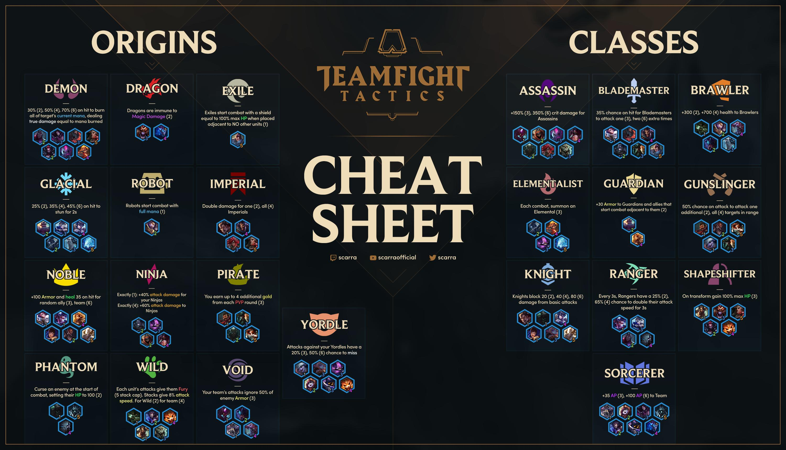

# TFT (League of Legends) Team Picker

> Have your team decided for you depending on your first selected champion.

## Project Description

I will be modeling a Graph ADT (Abstract Data Structure) to take in data of all the champions and classes in TFT(Team Fight Tactics). I will create a graph with the champions as the vertices and the champion's inherited classes as edges. All the champions of the same class are gonna be interconnected. Given the first selected champion by the user, the graph will generate a set of champions that can be picked within the game to receive the most optimal team combination with the most in game bonuses.

## Project Problems

* Based on your current champion
  * Which class should you complete first.
* What class should be built next, depending on the number of slots left after completing the first class.
